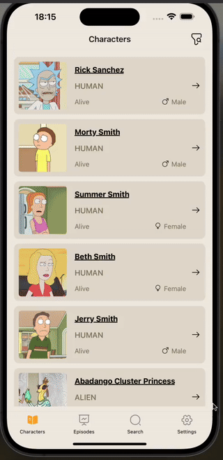

<h1>Rick and Morty App</h1>

This project is a Rick and Morty application developed using React Native, Redux, and React Navigation. It leverages the Rick and Morty API to display character information and episodes providing users with a comprehensive browsing experience within the Rick and Morty universe.

<h2>Features</h2>

<ul>
        <li>Developed using React Native to ensure cross-platform compatibility (iOS and Android).</li>
        <li>State management is handled using Redux, offering a predictable state container for JavaScript apps.</li>
        <li>Navigation between screens is managed by React Navigation, providing a smooth and intuitive user experience.</li>
        <li>Real-time data fetching from the Rick and Morty API to display character details and episodes.</li>
        <li>Modular component structure for easy maintenance and scalability.</li>
        <li>Responsive design for an optimal experience on various screen sizes.</li>
        <li>Includes various animations for enhanced user interaction.</li>
</ul>

<h2>Screen Gif</h2>

